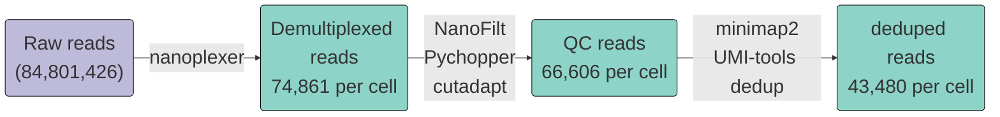
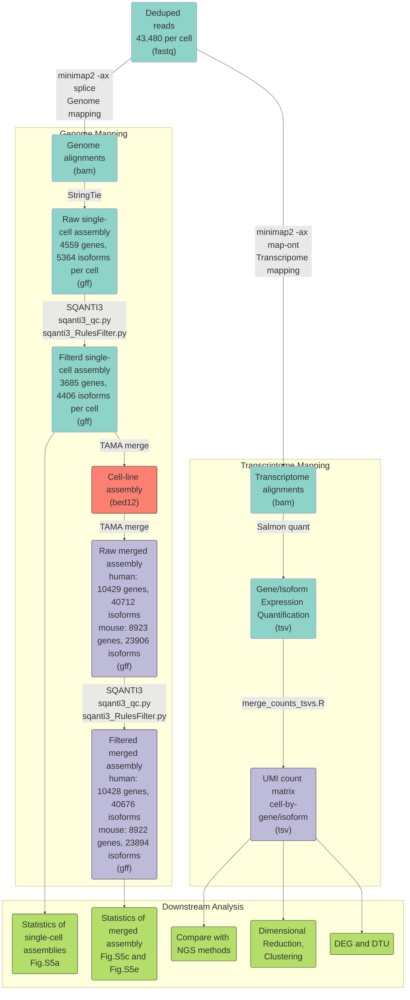
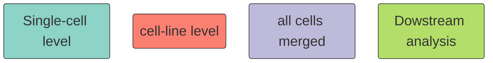

# SCAN-seq2
SCAN-seq2  is a high-throughput, high sensitivity full-length single-cell RNA-seq method by third-generation sequencing. 

This repository provide code for SCAN-seq2 data processing and downstream analysis.

## Pipelines for SCAN-seq2 data processing

- Demultiplexing and raw read processing:

- Transcriptome assembly and quantification:

- VDJ recombination of TCR and BCR:
%%{init: {"theme": "base", 'themeVariables': { "fontSize": "30px","fontFamily": "Arial"}}}%%
graph TD

Align_Genome("Genome alignments (bam)") -- samtools --> reads("IGH/IGL/IGK/TRA/TRB reads (fastq)") --usearch--> cluster("Reads clusters (cluster fastq)")--> large_clustrer("Largest cluster (fastq)")--centroid--> centroid("centroid reads")
large_clustrer --> Other("Other reads")

subgraph Main 
centroid  --racon--> pol1(Polished sequence I)
pol1 -. 4 rounds of racon.->pol4(Polished sequence Iv) -- Medaka --> con("Consensus sequence (fasta)")
end

subgraph Other reads
Other --racon--> pol1
Other -. 4 rounds of racon.->pol4(Polished sequence Iv)
Other -- Medaka --> con("Consensus sequence (fasta)")
end

con --IgBlast--> VDJ("V(D)J calls (tsv)")

classDef merge fill:#bebada,stroke:#000000;
classDef cl fill:#fb8072,stroke:#000000;
classDef sc fill:#8dd3c7,stroke:#00000;
classDef down fill:#b3de69,stroke:#000000;

Legend:
