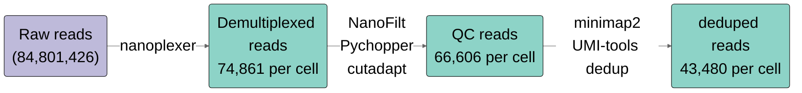
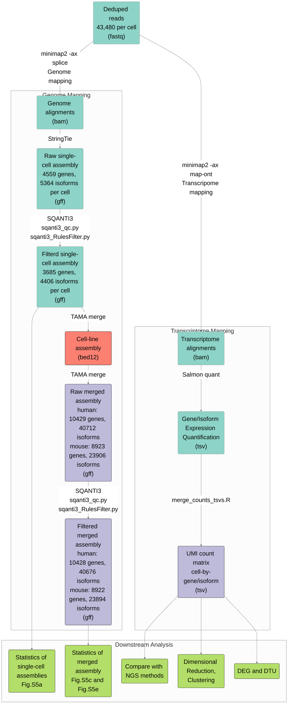
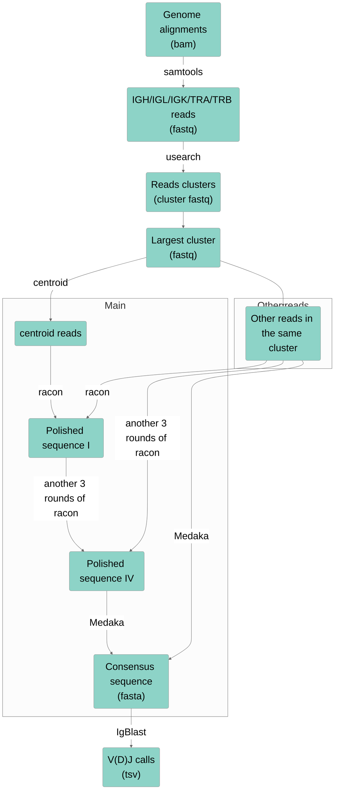

# SCAN-seq2
SCAN-seq2  is a high-throughput, high sensitivity full-length single-cell RNA-seq method by Nanopore sequencing. 

This repository provide source code for SCAN-seq2 data processing and downstream analysis.

Structure of the repository: 

```bash
.
├── 1.Pipeline # bash script of SCAN-seq2 data processing
│   ├── S01.umi.demultiplex.sh  ## Demultiplex ONT reads
│   ├── S02.umi.process.one.sh  ## QC, deduplication and trancriptome quantification
│   ├── S03.umi.Summarize.sh    ## Summarize statistics, merge UMI count matrix
│   ├── S04.umi.assemble.one.sh ## Reference-guided trancriptome assemble
│   ├── S05.umi.VDJ.BCR.one.sh  ## Immune repertoire profiling of immunoglobulin.
│   ├── S05.umi.VDJ.TCR.one.sh  ## Immune repertoire profiling of T cell receptor
│   ├──merge_counts_tsvs.R      ## Merge UMI count matrix
│   └──MergeAssembly
│       ├── MergeAssembly.all.sh ## Merge cell-line assemblies
│       ├── MergeAssembly.sh     ## Merge single-cell assemblies
│       └── Sbatch.MergeAssembly.sh
│
├── 2.Dowstream_Library # Downstream analyis of each separate SCAN-seq library
│   ├── 9CL.R      ## 9CL library
│   ├── 4CL.R      ## 4CL library
│   ├── 9CL_Mix.R  ## 9CL_Mix library
│   ├── UMI_100.R  ## UMI_100 library
│   ├── UMI_200.R  ## UMI_200 library
│   └── IGG.R      ## IGG6, IGG24 and IGG48 library
│
├── 3.Downstream_Merge # Downstream analysis of all libraries
│   ├── Part1_Technical_Performance 
│   │   ├── Technical_Performance.R  ## Technical performance of SCAN-seq2
│   │   └── Pseudogene.R             ## Systematic evaluation of pseudogene expression
│   ├── Part2_Transcriptome_Assembly
│   │   ├── BCR_TCR_gtf
│   │   │   ├── Hg38.IGH.gtf
│   │   │   ├── Hg38.IGK.gtf
│   │   │   ├── Hg38.IGL.gtf
│   │   │   ├── Hg38.TRA.gtf
│   │   │   └── Hg38.TRB.gtf
│   │   ├── ModifGTF.R               ## Modif gtf files for IGV visualization
│   │   ├── Transcriptome_Assembly.R ## Analysis of trancriptome assemblies
│   │   ├── merge_human_6CL.SQANTI3_SQANTI3_report.pdf
│   │   ├── merge_human_6CL.SQANTI3_classification.filtered_lite_SQANTI3_report.pdf
│   │   ├── merge_mouse_3CL.SQANTI3_SQANTI3_report.pdf
│   │   └── merge_mouse_3CL.SQANTI3_classification.filtered_lite_SQANTI3_report.pdf
│   └── Part3_Isoginkgetin_Treatment
│       └── IGGTreatment.R           ## IGG treatment of Hela and HepG2 cell lines1
│
└── README.md
```

## Pipelines for SCAN-seq2 data processing

### Demultiplexing and raw read processing:


### Transcriptome assembly and quantification:


### Immune repertoire profiling:


