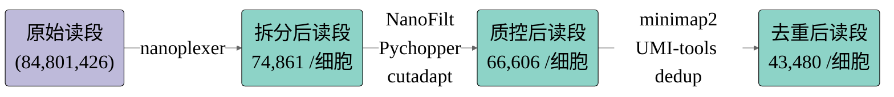
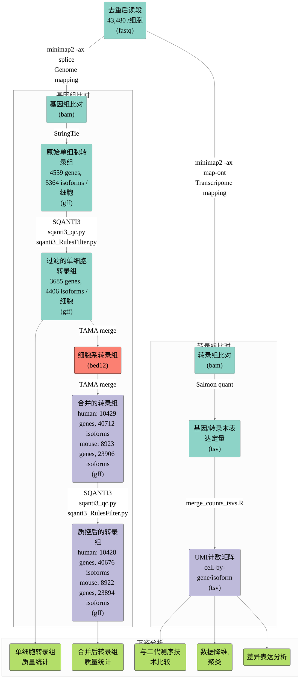
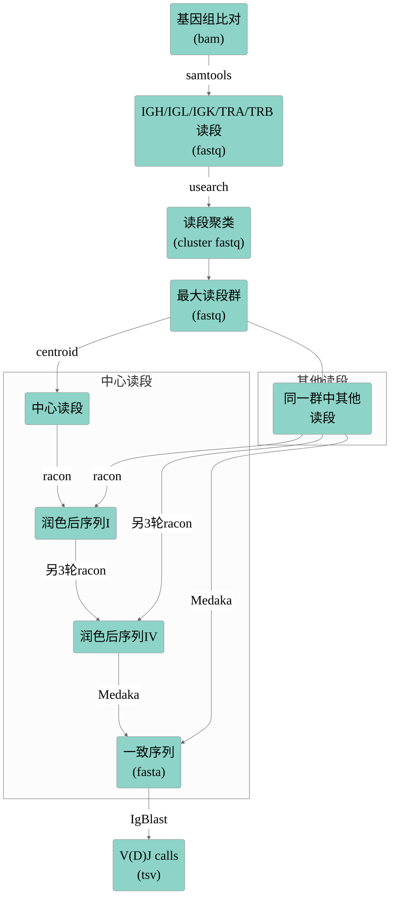

### 数据预处理:

```mermaid
%%{init: {"theme": "neutral", 'themeVariables': { "fontSize": "30px","fontFamily": "SimSun"}}}%%
graph LR
raw("原始读段</br>(84,801,426)"):::merge --nanoplexer--> demult("拆分后读段</br>74,861 /细胞"):::sc --NanoFilt<br/>Pychopper<br/>cutadapt--> QC(质控后读段</br>66,606 /细胞):::sc --minimap2<br/>UMI-tools dedup--> 
dedup(去重后读段</br>43,480 /细胞):::sc

classDef merge fill:#bebada,stroke:#000000;
classDef sc fill:#8dd3c7,stroke:#000000;
```

### 转录本组装与定量:

```mermaid
%%{init: {"theme": "neutral", 'themeVariables': { "fontSize": "30px","fontFamily": "SimSun"}}}%%
graph TD
dedup("去重后读段</br>43,480 /细胞</br>(fastq)"):::sc
subgraph 转录组比对
Align_cDNA("转录组比对</br>(bam)"):::sc --Salmon quant--> Quant("基因/转录本表达定量</br>(tsv)"):::sc --merge_counts_tsvs.R--> Matrix("UMI计数矩阵</br>cell-by-gene/isoform</br>(tsv)"):::merge 
end
subgraph 基因组比对
Align_Genome("基因组比对</br>(bam)"):::sc -- StringTie --> sc_Asm("原始单细胞转录组<br/>4559 genes, 5364 isoforms /细胞</br>(gff)"):::sc -- SQANTI3</br>sqanti3_qc.py</br>sqanti3_RulesFilter.py --> sc_Asm_2("过滤的单细胞转录组</br>3685 genes, 4406 isoforms /细胞</br>(gff)"):::sc -- TAMA merge --> cl_Asm("细胞系转录组</br>(bed12)"):::cl -- TAMA merge --> merge_Asm("合并的转录组</br>human: 10429 genes, 40712 isoforms</br>mouse: 8923 genes, 23906 isoforms</br>(gff)"):::merge -- SQANTI3</br>sqanti3_qc.py</br>sqanti3_RulesFilter.py -->  merge_Asm_2("质控后的转录组</br>human: 10428 genes, 40676 isoforms</br>mouse: 8922 genes, 23894 isoforms</br>(gff)"):::merge 
end
dedup --minimap2 -ax splice</br>Genome mapping--> Align_Genome
dedup --minimap2 -ax map-ont</br>Transcripome mapping--> Align_cDNA
subgraph 下游分析
sc_Asm_2 --> sc_stat("单细胞转录组质量统计</br>"):::down
merge_Asm_2 --> merge_stat("合并后转录组质量统计</br>"):::down
Matrix --> NGS("与二代测序技术比较"):::down
Matrix --> DR_cluster("数据降维,<br/>聚类"):::down
Matrix --> DEG("差异表达分析"):::down
end
classDef merge fill:#bebada,stroke:#000000;
classDef cl fill:#fb8072,stroke:#000000;
classDef sc fill:#8dd3c7,stroke:#00000;
classDef down fill:#b3de69,stroke:#000000;
```

### 免疫细胞表面受体鉴定

```mermaid
%%{init: {"theme": "neutral", 'themeVariables': { "fontSize": "30px","fontFamily": "SimSun"}}}%%
graph TD

Align_Genome("基因组比对</br>(bam)"):::sc -- samtools --> reads("IGH/IGL/IGK/TRA/TRB 读段<br/>(fastq)"):::sc --usearch--> cluster("读段聚类</br>(cluster fastq)"):::sc--> large_clustrer("最大读段群</br>(fastq)"):::sc--centroid--> centroid("中心读段"):::sc
large_clustrer --> Other("同一群中其他读段"):::sc

subgraph 中心读段
centroid  --racon---> pol1(润色后序列I):::sc
pol1 -- 另3轮racon--->pol4(润色后序列IV):::sc -- Medaka ----> con("Consensus sequence</br>(fasta)"):::sc
end

subgraph 其他读段
Other --racon---> pol1
Other -- 另3轮racon-->pol4
Other -- Medaka --> con("一致序列</br>(fasta)")
end

con --IgBlast--> VDJ("V(D)J calls</br>(tsv)"):::sc

classDef merge fill:#bebada,stroke:#000000;
classDef cl fill:#fb8072,stroke:#000000;
classDef sc fill:#8dd3c7,stroke:#00000;
classDef down fill:#b3de69,stroke:#000000;
```

